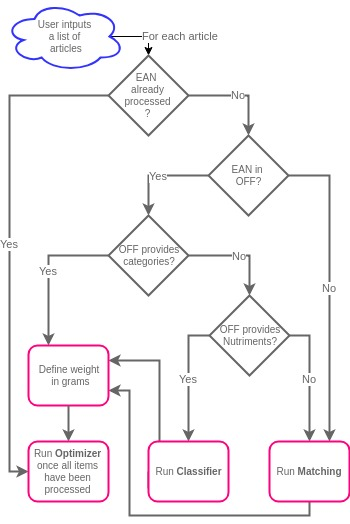

# Phenix project - Happy meal algorithm

The main goal of this repository is to create balanced meals from a list of products

## Understanding our algorithm
### Overview of the balanced meal generation process

In the following workflow, EAN means European Article Number and OFF Open Food Facts.



(The source code of this workflow can be found [here](static/Input2BalancedMeals.xml))

### Matching
We used the Naive Bayes method in order to automatically assign categories to articles according to their names.
### Classifier
We used the Random Forest method (40 trees) to automatically assign categories to articles according to their nutrients (6 features).
### Defining weights in grams
This algorithm works as follow: 

- If the quantity is mentioned in OFF, then converts the quantity in grams
    - if not, then compute the average of article's category quantities
- If the article is rice, semolina, pasta or instant mashed potatoes, then multiply by a specific coefficient
### Optimizer
Description can be found [here](https://github.com/dataforgoodfr/batch5_phenix_happymeal/tree/master/meal_balancer/algos_optimisation).
### Reallocating remaining articles
_add a description here_

## Requirements
The numpy and [openfoodfacts](https://github.com/openfoodfacts/openfoodfacts-python) packages are required to properly use the repo.
Tested on the following version:
```python
import sys
import numpy, openfoodfacts
print('Python %s' % '.'.join(map(str, sys.version_info[:3])))
print('Numpy %s, Openfoodfacts %s' % (numpy.__version__, openfoodfacts.__version__))
```
```console
Python 3.6.5
Numpy 1.15.0, Openfoodfacts 0.1.0
```

## How to use it
Depending on the feature you wish to test, you may need an Internet connection (product information)

### Product information

Pass a barcode (EAN) as argument of the demo script:
```bash
python product_info_demo.py 3392460480827
```

### Meal balancing

Run a simulation with the demo script similarly as below:
```bash
python tetris_demo.py 1000 --item_max_qty 100. --portion_size 500. --overflow_thresh 0.2 --underflow_thresh 0.1
```

which should return the result of the algorithm:
```bash
------------
RESULT
------------
40 batches for 1 persons (portion of 500.0): 502 items
1 batches for 3 persons (portion of 500.0): 27 items
3 batches for 2 persons (portion of 500.0): 65 items
Average batch loss: 41.91587070338677
Number of remaining items: 201 portioned, 4 unportioned
Number of large items: 201
Number of unindentified items: 0
```

Many parameters can be adjusted with the previous arguments.
To check the full list of arguments and their meaning, use the help of the parser:
```bash
python tetris_demo.py -h
```

## Useful links

- Understanding Git
    - [Git Data Transport commands](https://appendtonew.wpengine.com/wp-content/uploads/2015/06/Screen-Shot-2015-06-24-at-8.37.13-PM-1024x663.png)
    - [Git Cheat Sheet](https://www.dropbox.com/s/jsivybz7qmj4od4/git-cheat-sheet-v2.pdf?dl=0)
- [Project Slack](https://data-for-good.slack.com)
- [Project Trello](https://trello.com/b/X9SX81OU/algo-matching-db-open-food-fact)


## TODO
- [x] Implement an EAN - product information function
- [x] Implement a naive meal balancing algorithm
- [ ] Explore brute force and smart optimisation techniques
